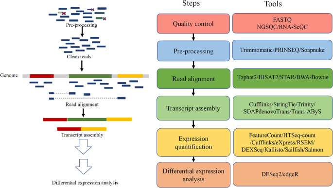
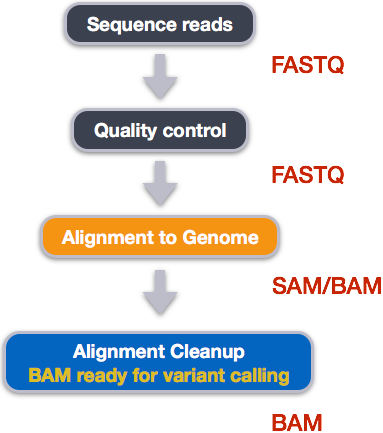
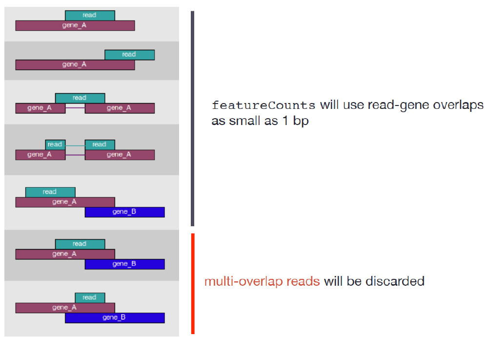
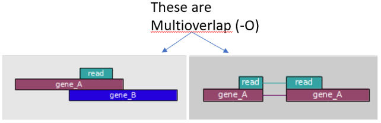
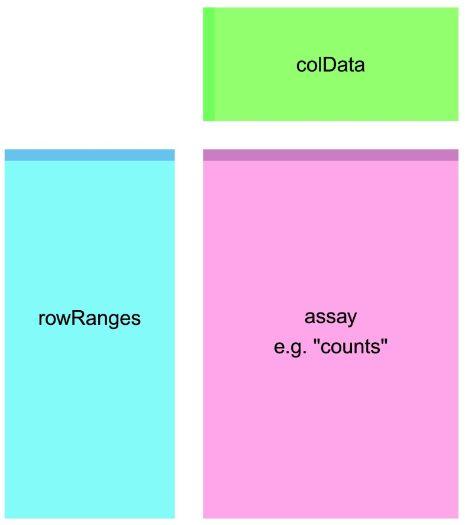
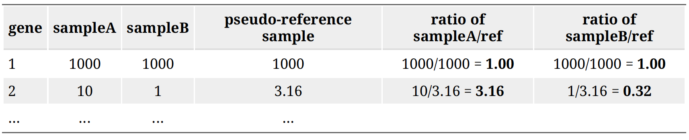
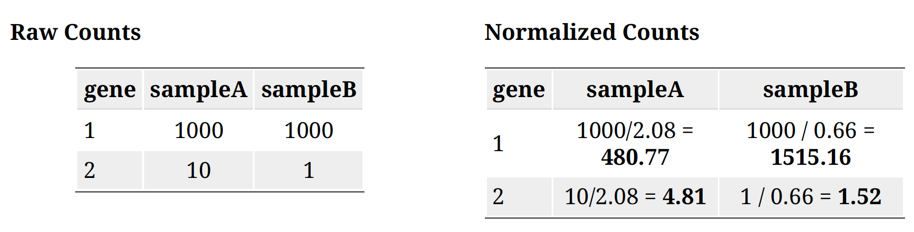

# RNAseq diferential & exploratory analysis

This should be the same counts file you generated, but now we're going to do a bit more with them in R. There are six yeast RNAseq samples.

```{r setup, include=FALSE}

# default to not showing code, you can change it for chunks as you like
knitr::opts_chunk$set(message = FALSE, warning = FALSE)


```


```{r LoadPackages, results='hide', message = FALSE,include=FALSE}

# Install function for packages (I shamelessly stole this from stackoverflow)
packages<-function(x){
  x<-as.character(match.call()[[2]])
  if (!require(x,character.only=TRUE)){
    install.packages(pkgs=x,repos="http://cran.r-project.org")
    require(x,character.only=TRUE)
  }
}

bioconductors <- function(x){
    x<- as.character(match.call()[[2]])
    if (!require(x, character.only = TRUE)){
      if (!require("BiocManager", quietly = TRUE))
      install.packages("BiocManager")
      BiocManager::install(x)
      require(x, character.only = TRUE)
    }
}


```

## Differential Expression Testing

Read the documents: https://bioconductor.org/packages/release/bioc/vignettes/DESeq2/inst/doc/DESeq2.html

Installs:
```{r eval=FALSE, results='hide', include=FALSE}
packages(ggplot2)
packages(pheatmap)
packages(plyr)
packages(dplyr)
packages(tidyr)
packages(data.table)
bioconductors(edgeR)
bioconductors("tximport")
bioconductors("DESeq2")
packages("devtools")
bioconductors("RColorBrewer")
devtools::install_github("karthik/wesanderson")
bioconductors("org.Sc.sgd.db")
bioconductors("GOstats")
bioconductors("edgeR")


```


Load Libraries: 
```{r, warning = FALSE, message = FALSE}

library(ggplot2)
library(pheatmap)
library(vsn)
library(dplyr)
library(tidyverse)
library(ggrepel)
library(plyr)
library(tidyr)
library(data.table)
library(DESeq2)
library(edgeR)
library(readr)
library(tximport)
library(DESeq2)
library(tidyverse)
library(RColorBrewer)
library(wesanderson)
library(org.Sc.sgd.db)

```

In this exercise we are going to walk through the NGS pipeline for rna-seq, starting from FASTQ files and ending with analyzed rna-seq data. While this is running we will try and see if we can recapitulate this in the command line using a shell script. The workflow in this process begins with 



In order to generate a count matrix from FASTQ reads, we need to 1) index the reference file to the genome we are working with, 2) process our raw FASTQ reads, 3) perform quality checks, 4) align the samples to the genome and 4) assemble the alignment to generate the count matrix, as shown in the figure above.

We can do this in R using the Rsubread package, but it is rather slow. 
So what we are going to do while it is running is to run the same process in
the command line using the conda subread package. The results should be identical, but it will be nice for you to get a feel for both (especially for those of you who don't have terminal emulators and are on linux machines).

Step 1. Indexing the reference file. Why does it mean to we index a reference file? Indexing a genome can be explained similar to indexing a book. If you want to know on which page a certain word appears or a chapter begins, it is much more efficient/faster to look it up in a pre-built index than going through every page of the book until you found it. Same goes for alignments. Indices allow the aligner to narrow down the potential origin of a query sequence within the genome, saving both time and memory.

To index the reference file we need the reference genome file Saccharomyces_cerevisiae.R64-1-1.dna.toplevel.fa.gz that contains all of the DNA sequences. We also need the gtf file which contains GTF file which contains all of the genomic features, exons, transcripts, genes noncoding regions etc. If we run the alignments and generate the counts in R using this package with the same parameters as we use in subread they should generate identical count matrices. The R version takes about 20' to run. Make sure you have a copy of Saccharomyces_cerevisiae.R64-1-1.96.gtf.gz and Saccharomyces_cerevisiae.R64-1-1.dna.toplevel.fa.gz in your appropriate directories as listed below. 

So we can run this first bit which sets up the names of the files:

```{r ReadingData}
setwd("~/Documents/RProjects/genomics/RNA-genomics")
fastq = list.files("FASTQ")
g = grep("fastq.gz",fastq)
fastq = fastq[g]
fastq.files = paste("FASTQ",fastq,sep = "/")
fastq.files = file.path("FASTQ",fastq)

# here we are just generating the names of theà bamfiles
bam = gsub("FASTQ/","BAM/",fastq.files)

bam = gsub(".fastq.gz",".bam",bam)

bam.files = bam
gtf.file = "FASTQ/r64/Saccharomyces_cerevisiae.R64-1-1.96.gtf.gz"

bam.files
gtf.file
fastq.files
```

Now we'll run the alignment:
```{r eval=FALSE}

# first build the index
library(Rsubread)
Rsubread::buildindex(basename="r64/r64.index", memory = 1000,
reference="FASTQ/r64/Saccharomyces_cerevisiae.R64-1-1.dna.toplevel.fa.gz")

# since  we want to distinguish these from the bamfiles
# we generated in the terminal, lets change their name so we remember they were generateed in R
bam.files = gsub("ERR458","R",bam.files)

```

And now we will align the reads; we will go with the default parameters EXCEPT
we will add the argument sortReadsByCoordinates=TRUE which will be convenient for downstream analysis. I also set nthreads to 64, which is the physical core of a CPU to help speed things up -- 64 is the maximum for my computer -- but the number of threads you use doens't seem to help the speed much.

OK, let's start this and then come back to it.
```{r eval=FALSE}

Rsubread::align(index = "r64/r64.index", readfile1 = fastq.files,
output_file = bam.files,useAnnotation=TRUE,annot.ext = "FASTQ/Saccharomyces_cerevisiae.R64-1-1.96.gtf.gz",isGTF = TRUE,nthreads=64,sortReadsByCoordinates=TRUE, keepReadOrder=FALSE)
```

Once we have our reads aligned to the genome, the next step is to count how many reads have mapped to each gene as a measure of gene expression. There are many tools that can use BAM files as input and output the number of reads (counts) associated with each feature of interest (genes, exons, transcripts, etc.). Two commonly used counting tools are featureCounts and summarize overlaps.Counting reads is not a straight forward task and there are many factors that bias the final count tally.

The last panel of this figure should dread BAM ready for count calling:


The above tools only report the “raw” counts of reads that map to a single location (uniquely mapping) and are best at counting at the gene level. Essentially, total read count associated with a gene (meta-feature) = the sum of reads associated with each of the exons (feature) that “belong” to that gene.

There are other tools that will count multimapping reads (sequences that align to more that one position in the genome), but this is a dangerous thing to do since you will be overcounting the total number of reads which can cause issues with normalization and eventually with accuracy of differential gene expression results -- personally I think this is arguable. In RNA-seq, you want to know the total number of transcripts of a particular gene regardless of where it is in the genome and ignoring these genes can lead to missing a lot of genes that may be duplicated in the genome, particularly as these genes are often under the same regulatory control.

Tools for counting require as input multiple BAM files a GTF file which contains all of the genonomic features, exons, transcripts, genes noncoding regions etc.


Simply speaking, the genomic coordinates of where the BAM reads are mapped are cross-referenced with the genomic coordinates of whichever feature you are interested in counting expression of (GTF), it can be exons, genes or transcripts.

Output of counting = A count matrix, with genes as rows and samples are columns


These are the “raw” counts and will be used in statistical programs downstream for differential gene expression.

Counting using featureCounts
This tool is frequently used because it is accurate, fast and is relatively easy to use. It also has a lot of options that other software tools don't have. featureCounts counts reads that map to a single location (uniquely mapping) and discards reads that are ambiguous, following the scheme in the figure below using the gtf file and BAM files as input.


FeatureCounts has an option to count multi-mapping reads, that most other counting software tools don't have. "Multi-overlapping" reads are reads that overlap with more than one position in the chromosome, but do not overlap more that one feature -- not to be confused with "multi-mapping" reads where a read overlaps more than one feature in the genome. FeatureCounts is a widely used tool and the consensus is that these multi-mapping reads should not be counted in a RNA-seq experiment because such reads are ambiguous as it is unclear which gene they originated from. 





Genomic multireads are primarily due to repetitive sequences or shared domains of paralogous genes. However, when you look at the literature for best practices for RNA seq they explicitly state that these sequences should not be discarded as they normally account for a significant fraction of the mapping output when mapped onto the genome. When the reference is the transcriptome, multi-mapping arises even more often because a read that would have been uniquely mapped on the genome would map equally well to all gene isoforms in the transcriptome that share the exon. In either case — genome or transcriptome mapping — transcript identification and quantification become important challenges for alternatively expressed genes. For this reason we have decided to include these features in our analysis.



FeatureCounts only takes a few inputs,and in fact the default for the argument 
countMultiMappingReads is set to TRUE, so we don't need to add it. 

You should look up featureCounts help menu in RStudio to see all of the options as it is quite extensize, also
compare it to looking the help file up in the terminal by typing featureCounts -h. Even though the conda package subread and the R package Rsubread come from the same source, the options are are not the same, and are quite complex.

```{r featureCounts}

library(Rsubread)

fc <- featureCounts(bam.files, annot.ext=gtf.file,
isGTFAnnotationFile=TRUE,
isPaired=FALSE)


```

Another popular method of extracting count files from BAM files is by using `summarizeOverlaps` from the GenomicAlignments package. `summarizeOverlaps` uses only the exons extracted from the TxDb object (which stores relationships between pre-processed mRNA transcripts, exons, protein coding sequences, and genes construncted from the gtf file.

We specify a number of arguments besides the features and the reads. 
The mode argument describes what kind of read overlaps will be counted, as in featureCounts (see below). Note that fragments will be counted only once to each gene, even if they overlap multiple exons of a gene which may themselves be overlapping.


```{r summarizeOverlaps}

library(GenomicFeatures)
txdb <- makeTxDbFromGFF(gtf.file, format="gtf")
exons.by.gene <- exonsBy(txdb, by="gene")

library(Rsamtools)

bam.list <- BamFileList(bam.files)

library(GenomicAlignments)

# ignore.strand=TRUE -- the prep was not generated by a strand-specific protocol,# inter.feature=TRUE, When FALSE, these reads are retained and counted oncefor each feature they map to, 
# 
se <- summarizeOverlaps(exons.by.gene, bam.list, mode=Union,
       inter.feature=TRUE, singleEnd=TRUE,ignore.strand = TRUE)

ase = assays(se)$counts
g=grep("^Y" ,rownames(ase))
ase = ase[g,]

```

Now let's plot the two against each other to see how they compare.

Compare summarizedOverlaps to featureCounts: 
```{r}
m=match(rownames(assay(se) ),rownames(fc$counts))

plot(assay(se[,1]),fc$counts[m,1],ylab = "featureCounts",xlab = "summarizeOverlaps",pch=19)

counts = fc$counts 
g = grep("^Y",rownames(counts))
counts = counts[g,]
counts = counts[order(rownames(counts)),]

# From the script subreadMapping.sh
cnts = read_tsv("counts.txt",skip = 1)
cts = as.matrix(cnts[,7:12])
rownames(cts)=cnts$Geneid
gg= grep("^Y",cnts$Geneid)
cts = cts[gg,]
cts = cts[order(rownames(cts)),]

colnames(cts)=basename(colnames(cts))
table(all.equal(counts,cts))
```
 
We can see that, featureCounts and summarizeOverlaps produce the same results. And the counts generated from the subreadMapping.sh
equals those generated in R.

A word about summarized experiments. The way summarized experiments are set up is that the rownames of the colData or metadata, also sometimes called phenoData, must match the colnames of the assay data -- the count data or expression data. Similarly, the rownames of the assay data must match the rowRanges of the featureData. This is all part of Bioconductor's way of standardizing structures so that they work well with each other across and within packages.



Translating orf names to gene names:
```{r annotation}

library(org.Sc.sgd.db)
eid = keys(org.Sc.sgd.db)
gene=AnnotationDbi::mapIds(org.Sc.sgd.db, keys = eid, column = "GENENAME", keytype = "ORF")

m=match(rownames(counts),names(gene))

table(is.na(m))

wna = which(is.na(gene))

gene[wna]=names(gene)[wna]

length(wna)
genecnts = counts
rownames(genecnts)=gene[m]
```


Let's rename our colnames of counts from bamfile names back to our original sample names before we start our differential analysis:
```{r rename}


library(readr)
library(dplyr)
meta <- read_csv("https://osf.io/cxp2w/download")
meta = meta[,-2]
names(meta)[2] = "genome"
meta$genome = factor(meta$genome)
meta$genome = relevel(meta$genome,ref = "wt")
# make wild-type the reference to which expression in snf2 samples is compared to
meta = meta %>% arrange(sample)
meta$sample
meta = data.frame(meta,stringsAsFactors = F)
rownames(meta)=meta$sample
colnames(counts) = gsub(".bam","",colnames(counts))
```

Looks good, this meets the requirement of a summarized experiment:
```{r}
colnames(counts) == meta$sample
```

## DESeq2 workflow


To run DESeq2 analysis, you have to check to make sure that all rows labels in meta are columns in data:
```{r}
all(colnames(counts) == rownames(meta))
```


Create the dataset and run the analysis:
```{r}
dds <- DESeqDataSetFromMatrix(countData = counts, colData = meta, design = ~genome)

dds$genome <- relevel(dds$genome, ref = "wt") # make wild-type the reference to which expression in treatment samples is compared to 
dds <- DESeq(dds)
```


```{r} 
dds <- DESeq(dds,fitType='mean')
```

- **Read in Data**

We've already read in the metadata for our experiment, let's view it:
```{r}
view(meta)
```


Behind the scenes these steps were run in DESeq2 function:
1.estimating size factors
2.gene-wise dispersion estimates
3.mean-dispersion relationship
4.final dispersion estimates
5.fitting model and testing

The design formula `design = ~genome` tells DESeq2 which factors in the metadata to test, such as control v.s. treatment. Here our condition is wt v.s. snf2 as shown in the `meta`.

The design can include multiple factors that are columns in the metadata. In this case, the factor that you are testing for comes last, and factors that you want to account for come first. E.g. To test for differences in condition while accounting for sex and age: `design = ~ sex + age + condition`. It's also possible to include time series data and interactions.

## DESeq2 count normalization

Let’s see how, in practice, we can use DESeq2 median-of-ratios method to normalize the gene counts.

Geometric mean:
exp(mean(log(data[data>0])))
  $$geometricmean = exp(mean(log(x[x>0])))$$
	$$(\prod_{x = 1}^{n})^ \frac{1}{n} = \sqrt[n]{x_{1}x_{2}...x_{n}}$$

Step 1: creates a pseudo-reference sample (row-wise geometric mean).
For each gene, a pseudo-reference sample is created that is equal to the geometric mean across all samples.


Step 2: calculates ratio of each sample to the reference.
Calculate the ratio of each sample to the pseudo-reference. Since most genes aren't differentially expressed, ratios should be similar.



Step 3: calculate the normalization factor for each sample (size factor).
The median value of all ratios for a given sample is taken as the normalization factor (size factor) for that sample:


```{r}
normalization_factor_sampleA <- median(c(1.00, 3.16))
normalization_factor_sampleB <- median(c(1.00, 0.32)) 
normalization_factor_sampleA 
normalization_factor_sampleB
```

Step 4: calculate the normalized count values using the normalization factor. This is performed by dividing each raw count value in a given sample by that sample's size factor to generate normalized count values.

```{r}
normalization_factor_sampleA = 2.08
 
normalization_factor_sampleB = 0.66
```



- **Unsupervised Clustering**

This step is to asses overall similarity between samples:
1.Which samples are similar to each other, which are different?
2.Does this fit to the expectation from the experiment’s design?
3.What are the major sources of variation in the dataset?

To accomplish this we use Principle component analysis. Principal component analysis (PCA) is a mathematical algorithm that reduces the dimensionality of the data while retaining most of the variation in the data set1. It accomplishes this reduction by identifying directions, called principal
components, along which the variation in the data is maximal. By using a few components, each sample can be represented by relatively few
numbers instead of by values for thousands of variables. Samples can then be plotted, making it possible to visually assess similarities and differences
between samples and determine whether samples can be grouped. PCA can be used to represent samples with a smaller number of variables, visualize samples and genes, and detect dominant patterns of gene expression. PCA is extremely powerful for use in exploring large-scale data sets in which
thousands of variables have been measured. It can act as a quick gut check to test whether your data is in aligning with your metadata, for example. 

- **Principle Components Analysis**

Here we use the built in function plotPCA from DESeq2 (built on top of ggplot). The regularized log transform (rlog) improves clustering by log transforming the data.

```{r, fig.width = 5, fig.height = 15}
rld <- rlog(dds, blind=TRUE)
plotPCA(rld, intgroup="genome") + geom_text(aes(label=name))
```


- **Creating contrasts and running a Wald test**

The null hypothesis: log fold change = 0 for across conditions. P-values are the probability of rejecting the null hypothesis for a given gene, and adjusted p values take into account that we've made many comparisons:
```{r}
contrast <- c("genome", "wt", "snf2")
res_unshrunken <- DESeq2::results(dds, contrast=contrast)
summary(res_unshrunken)
```

Here shows a summary of up- or down-regulated genes:

- **Shrinkage of the log2 fold changes**

One more step where information is used across genes to avoid overestimates of differences between genes with high dispersion. This is not done by default, so we run the code:
```{r}
res <- lfcShrink(dds, contrast=contrast, res=res_unshrunken,type="normal")
```


## Visualizing RNA-seq results 

**Count Data Transformations:** 
To improve the distances/clustering for the PCA and heirarchical clustering visualization methods, we need to moderate the variance across the mean by applying the `rlog` or `vst` transformation to the normalized counts.

The the `rlog` or `vst` transformations of the normalized counts is only necessary for these visualization methods during this quality assessment. We will not be using these tranformed counts downstream.

**rlog**: "transforms the count data to the log2 scale in a way which minimizes differences between samples for rows with small counts, and which normalizes with respect to library size. The rlog transformation produces a similar variance stabilizing effect as varianceStabilizingTransformation, though rlog is more robust in the case when the size factors vary widely. The transformation is useful when checking for outliers or as input for machine learning techniques such as clustering or linear discriminant analysis." -- from function documentation 

```{r, cache=TRUE}
rld <- rlog(dds, blind=TRUE)
head(assay(rld), 3)
```

**Variance stabilizing transformation (so much faster than rlog):**
"This function calculates a variance stabilizing transformation (VST) from the fitted dispersion-mean relation(s) and then transforms the count data (normalized by division by the size factors or normalization factors), yielding a matrix of values which are now approximately homoskedastic (having constant variance along the range of mean values). The transformation also normalizes with respect to library size. The rlog is less sensitive to size factors, which can be an issue when size factors vary widely. These transformations are useful when checking for outliers or as input for machine learning techniques such as clustering or linear discriminant analysis."" – from function documentation.

```{r, cache = TRUE}
vsd <- vst(dds, blind = TRUE)
head(assay(vsd), 3)
```

## Components of the PCA analysis - Variance explained
The statistical interpretation of singular values is in the form of variance in the data explained by the various components. The singular values produced by the `prcomp` (a function in R that produces principal components, along with `svd`) are in order from largest to smallest and when squared are proportional the amount of variance explained by a given singular vector.

To show how this works, let's try it out on our assay(rld):

```{r}

pca1 <- prcomp(t(assay(rld)), scale =FALSE,center = TRUE)

head(pca1$x)


```
You can see that the first two principal components align well with our expectations from our metadata.


```{r}
pr.out <- prcomp(x = t(assay(rld)), scale = FALSE, center = TRUE)
summary(pr.out)
cols=c("dodgerblue","darkorange")

plot(pr.out$x[,1],pr.out$x[,2],col=cols[as.numeric(as.factor(meta$genome))],main = "PCA",xlab="PC1",ylab="PC2",pch=19)

legend("bottomright",fill=cols,legend = c("snf2","wt"),pch=15, cex = 0.75)

```
# Importance of components:
#                           PC1    PC2    PC3    PC4
# Standard deviation     1.3721 0.9933 0.8526 0.6354
# Proportion of Variance 0.4707 0.2467 0.1817 0.1009
# Cumulative Proportion  0.4707 0.7173 0.8991 1.0000
```{r}
# Variability of each principal component: pr.var
pr.var <- pr.out$sdev^2

# Variance explained by each principal component: pve
pve <- pr.var / sum(pr.var)
pve

# Plot variance explained for each principal component
plot(pve, xlab = "Principal Component",
     ylab = "Proportion of Variance Explained",
     ylim = c(0, 1), type = "b")


# Variability of each principal component: pr.var
pr.var <- pr.out$sdev^2

# Variance explained by each principal component: pve
pve <- pr.var / sum(pr.var)
pve

# Plot variance explained for each principal component
plot(pve, xlab = "Principal Component",
     ylab = "Proportion of Variance Explained",
     ylim = c(0, 1), type = "b")


# Plot cumulative proportion of variance explained
plot(cumsum(pve), xlab = "Principal Component",
     ylab = "Cumulative Proportion of Variance Explained",
     ylim = c(0, 1), type = "b")

```


As we can see from the first plot, we can see that the first component explains about 80% of all the variation in the data. In other words, even though there are 6 dimensions in the data, 80% of the variation in the data can be explained by a single dimension. That suggests that the data could be simplified quite a bit.

rlog PCA: 
```{r pca_rld}
data1 <- plotPCA(rld, returnData=TRUE, intgroup = "genome")
#data1$group<-gsub(" : ","_",as.character(data1$group))
percentVar1 <- round(100 * attr(data1, "percentVar"))

PCA<-ggplot(data1, aes(PC1, PC2, color = genome))+ theme_bw()+
  geom_point(size=9, alpha = 0.8) + scale_colour_manual(values = c("#44aabb","#bbbbbb"))+
  xlab(paste0("PC1: ",percentVar1[1],"% variance")) +
  ylab(paste0("PC2: ",percentVar1[2],"% variance")) +
  theme(text = element_text(size=20)) + ggtitle("rlog PCA")
PCA
#ggsave("figures/vsd_PCA.png", device="png") # to save the plot
```

variance stabilized PCA:
```{r pca_vst}
data1 <- plotPCA(vsd, returnData=TRUE,intgroup="genome")
#data1$group<-gsub(" : ","_",as.character(data1$group))
percentVar1 <- round(100 * attr(data1, "percentVar"))

PCA<-ggplot(data1, aes(PC1, PC2, color = genome))+ theme_bw()+
  geom_point(size=9, alpha = 0.8) + scale_colour_manual(values = c("#44aabb","#bbbbbb"))+
  xlab(paste0("PC1: ",percentVar1[1],"% variance")) +
  ylab(paste0("PC2: ",percentVar1[2],"% variance")) +
  theme(text = element_text(size=20)) + ggtitle("vst PCA")
PCA
#ggsave("figures/vsd_PCA.png", device="png") # to save the plot
```

## HeatMaps

rlog HeatMap:

To make heatmaps we need colors. The RColorBrewer package is a nice choice for this. RColorBrewer has several palettes, there are three types: "div","seq" and "qual". You can check them out typing:
```{r}
for (i in 1:5) {

display.brewer.all(n=NULL, type="all", select=NULL, exact.n=TRUE,colorblindFriendly=FALSE)

display.brewer.all(type="div")

display.brewer.all(type="seq")

display.brewer.all(type="qual") 

display.brewer.all(colorblindFriendly=TRUE)}
```

Each palette has a defined set of colors. To get a list of the palettes type:

```{r}
brewer.pal.info
```

To use a palette, simply type `brewer.pal` followed by the number of colors you want and the name of the palette, e.g.:

```{r}
set1 = brewer.pal(8, "Set1")
```


```{r heatmap_rld}

df <- as.data.frame(colData(rld)[,c("genome", "sample")])

mat_colors1<-list(sample = brewer.pal(12, "Paired")[0:6])
names(mat_colors1$sample)<- df$sample

mat_colors <- list(genome = brewer.pal(12, "Paired")[7:8])
names(mat_colors$genome) <- c("wt", "snf2")

genes <- order(res$padj)[1:1000]

pheatmap(assay(rld)[genes, ], cluster_rows=TRUE, show_rownames=FALSE,
         cluster_cols=FALSE, annotation_col=df, annotation_colors = c(mat_colors1, mat_colors), fontsize = 12)
```

variance stabilized HeatMap: 
```{r heatmap_vst}
df <- as.data.frame(colData(vsd)[,c("genome", "sample")])

pheatmap(assay(vsd)[genes, ], cluster_rows=TRUE, show_rownames=FALSE, show_colnames = FALSE,
         cluster_cols=FALSE, annotation_col=df, annotation_colors = c(mat_colors1, mat_colors), fontsize = 12)
```

Another option for heat maps: 
plot the difference from the mean normalized count across samples 
(and optionally change default colors)

With Rlog transformed data:
```{r heatmap_rld_meandiff}
library(wesanderson)
pal <- wes_palette(name = "Zissou1", n=2000 , type= "continuous")

mat_colors1<-list(sample = wes_palette("IsleofDogs1", 6))
names(mat_colors1$sample)<- df$sample

mat_colors <- list(genome = wes_palette("Cavalcanti1")[4:5])
names(mat_colors$genome) <- c("wt", "snf2")

mat <- assay(rld)[genes, ]
mat <- mat - rowMeans(mat)

df <- as.data.frame(colData(rld)[,c("genome", "sample")])

pheatmap(mat,  cluster_rows=TRUE, show_rownames=FALSE,
         cluster_cols=FALSE, annotation_col=df, annotation_colors = c(mat_colors1, mat_colors), fontsize = 12, color = pal)

```

Same but with variance stabilizing function:
```{r heatmap_vst_meandiff}
mat <- assay(vsd)[genes, ]
mat <- mat - rowMeans(mat)

df <- as.data.frame(colData(vsd)[,c("genome", "sample")])

pheatmap(mat,  cluster_rows=TRUE, show_rownames=FALSE, show_colnames = FALSE,
         cluster_cols=FALSE, annotation_col=df, annotation_colors = c(mat_colors1, mat_colors), fontsize = 12, color = pal)

```

Heatmap of sample-to-sample distances
```{r heatmap_sampledistance}
sampleDists <- dist(t(assay(vsd)))
sampleDistMatrix <- as.matrix(sampleDists)
rownames(sampleDistMatrix) <- paste(vsd$genome, vsd$type, sep="-")
colnames(sampleDistMatrix) <- NULL
colors <- colorRampPalette( rev(brewer.pal(9, "Blues")) )(255)
pheatmap(sampleDistMatrix,
         clustering_distance_rows=sampleDists,
         clustering_distance_cols=sampleDists,
         col=colors)
```

The summary of results after shrinkage can be viewed by typing `summary(res)` or `head(res)`. If you used `head(res)` you will be viewing the top few lines of the result containing log2 fold change and p-value. log2FoldChange = log2(snf2count/wtcount)Estimated from the model. padj - Adjusted pvalue for the probability that the log2FoldChange is not zero.


## Saving results
Now you have the table with log2 fold change and you might want to save it for future analysis. A adj value cutoff can be applied here. For example, here p-adj 0.05 is used.

```{r}
## Filtering to find significant genes
padj.cutoff <- 0.05 # False Discovery Rate cutoff
significant_results <- res[which(res$padj < padj.cutoff),]

## save results using customized file_name
file_name = 'significant_padj_0.05.txt'
# write.table(significant_results, file_name, quote=FALSE)
```

Now you have your analyzed result saved in txt file, which can be imported to Excel.

- **Exit R and save the work space**

If you want to take a break and exit R, type `q()`. The workspace will be automatically saved with the extension of `.Rproj`.

## Review DeSeq2 workflow
These comprise the full workflow
```{r eval=FALSE}
# Setup DESeq2
dds <- DESeqDataSetFromMatrix(countData = counts, colData = meta, design = ~genome)
# Run size factor estimation, dispersion estimation, dispersion shrinking, testing
dds <- DESeq(dds)
# Tell DESeq2 which conditions you would like to output
contrast <- c("genome", "snf2", "wt")
# Output results to table
res_unshrunken <- results(dds, contrast=contrast)
# Shrink log fold changes for genes with high dispersion
res <- lfcShrink(dds, contrast=contrast, res=res_unshrunken)
# Regularized log transformation (rlog)
rld <- rlog(dds, blind=TRUE)
```

Run DESeq2: 
```{r, cache = TRUE}
dds <- DESeq(dds)
```

Check out results: 
```{r}
res <- results(dds)
head(res)
```

Summarize results
```{r}
summary(res, alpha = 0.05) # default significance cut-off is 0.1, changing alpha to 0.05 changes the significance cut-off 
```


## Plotting single genes
Now, you can explore individual genes that you might be interested in. A simple plot can be made to compare the expression level of a particular gene. For example, for gene "YOR290C":
```{r}
par(pch=19)
plotCounts(dds, gene="YOR290C", intgroup="genome")
```


**Exercise**
Create a PCA plot from the DESeq2 object, using the vsd transformation and 500 of the most variable genes (default for plotPCA).
```{r}


```

The vst(dds, blind=FALSE) part performs a variance stabilizing transformation of the normalized counts, to prevent a handful genes with the highest expression levels and most variance from dominating the PCA plot.

**Exercise**
Create another PCA plot, this time using the 100 most variable genes (ntop=100), instead of the default of 500.
```{r}

```

**Exercise**
Perform the DESeq analysis on the dds dataset and get the results
```{r}


```


Get information on what the columns of the results contain:
```{r}

```

Filter the results for FDR < 0.05 and absolute value of Fold-Change > 2 (i.e., at least double or half the level of expression)

Make a dataframe with ORF and GENE as columns and arrange the data in order of padj and descending order by absolute value of log2FoldChange. Filter the results for those records that have padj < 0.05 and absolute value of res$log2FoldChange > 2.
```{r}

```

**Shrinkage of log fold change of genes with very low expression.**
Genes with very low expression usually have very noisy estimates of log2 fold changes. It is desirable to shrink the fold change of genes with low read counts, but not shrink the fold change of highly expressed genes too much. DEseq2 has implemented several different algorithms for shrinkage. The DESeq2 developers recommend to use apeglm method for shrinkage. Shrinkage is especially important if you plan to use LFC to rank genes for enrichment analysis (e.g., GSEA, to be covered next week).

Perform the shrinkage with "apeglm", then compare the MA plot
with or without shrinkage. 
```{r}


```

IGV

The Integrative Genomics Viewer (IGV) is a high-performance, easy-to-use, interactive tool for the visual exploration of genomic data. It supports flexible integration of all the common types of genomic data and metadata, investigator-generated or publicly available, loaded from local or cloud sources.

Development of IGV has been supported by funding from the National Cancer Institute (NCI) of the National Institutes of Health, the Informatics Technology for Cancer Reserarch (ITCR) of the NCI, and the Starr Cancer Consortium.

[James T. Robinson, Helga Thorvaldsdóttir, Wendy Winckler, Mitchell Guttman, Eric S. Lander, Gad Getz, Jill P. Mesirov. Integrative Genomics Viewer. Nature Biotechnology 29, 24–26 (2011).](https://www.ncbi.nlm.nih.gov/pmc/articles/PMC3346182/)

https://software.broadinstitute.org/software/igv/download


For this exercise we’ll be making use of IGV that you downloaded. The Saccharomyces cerevisiae genome that we used for the mapping is available here. It can be found under Genome -> S. cerevisiae (sacCer3)

The BAM files can be added tracks. Choose “Tracks -> local file”. Select all the .bam files and the accompanying .bai files.

You should get something like this:


If we want to see are reads we have to zoom in. Unfortunately, the web app doesn't make it easy to search for genes so we have to do it the hard way.

Question: pick five of your top hits in the DESeq2 analysis and see if they check out.


Question:

Look up a gene with an intron. How do the reads compare to genes without introns?


