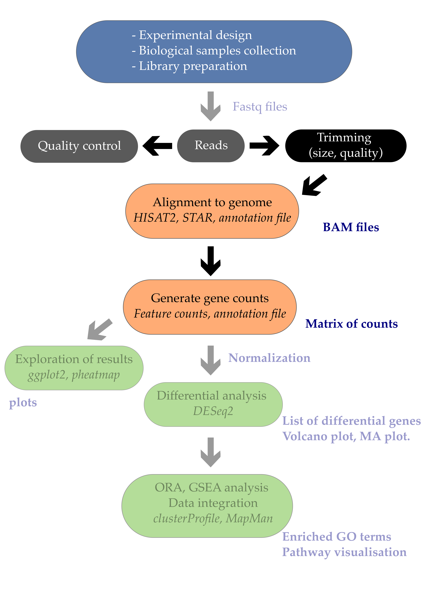

# Saccharomyces cerevisiae dataset



This section of the OMICS course will cover NGS sequencing from FASTQ reads to differential RNA analysis. The general workflow is shown above. We will use a dataset from Saccharomyces cereviseae. The bookdown version of these pages is published [here](https://bookdown.org/ggiaever/RNA-genomics/).

The best reference for rmarkdown documents is [R Markdown Cookbook](https://bookdown.org/yihui/rmarkdown-cookbook/).

```{r eval = FALSE}
# automatically create a bib database for R packages
knitr::write_bib(c(
  .packages(), 'bookdown', 'knitr', 'rmarkdown'
), 'book.bib')
```


