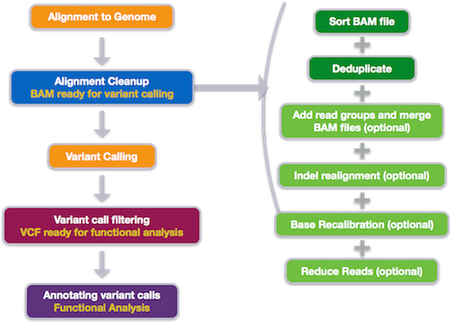

# Wrangling-Genomics

A lot of genomics analysis is done using command-line tools for three reasons:
1) you will often be working with a large number of files, and working through the command-line rather than through a graphical user interface (GUI) allows you to automate repetitive tasks,
2) you will often need more compute power than is available on your personal computer, and connecting to and interacting with remote computers requires a command-line interface, and
3) you will often need to customize your analyses, and command-line tools often enable more customization than the corresponding GUI tools (if in fact a GUI tool even exists).

In this lesson, you will be carrying out a common genomics workflow - identifying variants among sequencing samples taken from multiple individuals within a population. We will be starting with a set of sequenced reads (.fastq files), performing some quality control steps, aligning those reads to a reference genome, and ending by identifying and visualizing variations among these samples.

As you progress through this lesson, keep in mind that, even if you aren’t going to be doing this same workflow in your research, you will be learning some very important lessons about using command-line bioinformatic tools. What you learn here will enable you to use a variety of bioinformatic tools with confidence and greatly enhance your research efficiency and productivity.

**Prerequisites**
This lesson assumes a working understanding of the bash shell. If you haven’t already completed the Shell Genomics lesson, and aren’t familiar with the bash shell, please review those materials before starting this lesson.

This lesson also assumes some familiarity with biological concepts, including the structure of DNA, nucleotide abbreviations, and the concept of genomic variation within a population.

**Schedule**

1. Background and Metadata	What data are we using?

2. Assessing Read Quality	

3. Trimming and Filtering	

4. Variant Calling Workflow	

5. Automating a Variant Calling Workflow

Finish

